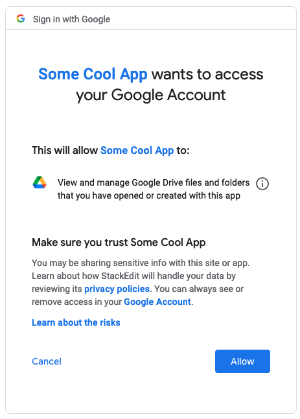

# Overview

`IDBSideSync-gdrive` is a JavaScript library meant to be used with IDBSideSync. While IDBSideSync provides the ability to proxy requests to IndexedDB data stores and persist database CRUD operations as CRDT-compatible "oplog" messages, `IDBSideSync-gdrive` is focused on syncing those messages with Google Drive.

# Usage

# Roadmap

- [x] Create simple GDrive test app to help learn how to use the gapi library, OAuth, etc.
- [x] Incorporate the library via `<script src...>` into the main `example-plainjs` app
- [ ] Build a really basic version of `.sync()` that just uploads oplog entries to GDrive

# Technical notes

## Google Drive Access

For the library to work, users of your app will need to see the Google OAuth pop-up and agree to it requesting permission to manage files/folders that the app has created:

More specifically, this means the library requires the `https://www.googleapis.com/auth/drive.file` scope, which allows the app to:
  - View files from Google Drive that the user has opened with your app or that are shared publicly
  - Save changes to files that the user has opened with your app
  - Create new files in Google Drive using your app
  - View folders and their contents from Google Drive that the user has opened with your app
  - Make changes to folders and their contents that the user has opened with your app
  - Delete contents of folders that the user has opened with your app

The library deliberately avoids requesting "full access" to google drive (i.e., the `https://www.googleapis.com/auth/drive` scope).

It also avoids using a Google Drive [Application Data](https://developers.google.com/drive/api/v3/appdata) folder (i.e., the `https://www.googleapis.com/auth/drive.appdata` scope) since [users can't easily access these folders](https://stackoverflow.com/a/36487545/62694) or the files in them, which really goes against the idea that someone should be able to view and download their own data.
